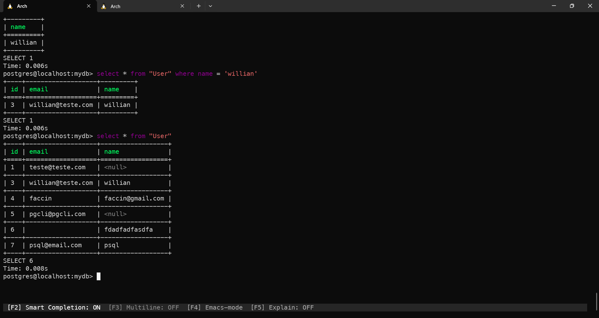

# Postgres com Docker e prisma ORM

#### 🛠️ Projeto para aprender a gerar o postgreSQL com e conectar com o Prisma ORM

- criar o `postgres com docker`
  - criei um `docker compose` com a imagem do postgres-alpine:

  ``` yml
  services:
  postgres:
    container_name: postgres
    image: postgres:16-alpine3.20
    environment:
      - POSTGRES_USER=postgres
      - POSTGRES_PASSWORD=postgres
      - POSTGRES_DB=mydb
    ports:
      - 5432:5432
    volumes:
      - postgres_data:/var/lib/postgresql/data/
  volumes:
    postgres_data:
  ```
- usar `prisma ORM` para conectar com o postgres 
  - Criei um schema do prisma simples para apenas aprender a conectar com o postgres

  ``` js
    generator client {
    provider = "prisma-client-js"
  }

  datasource db {
    provider = "postgresql"
    url      = env("DATABASE_URL")
  }

  model User {
    id    Int     @id @default(autoincrement())
    email String  @unique
    name  String?
  }

  ```
- consultar as tabelas e ver se esta tudo certo usando `pgcli`
 
